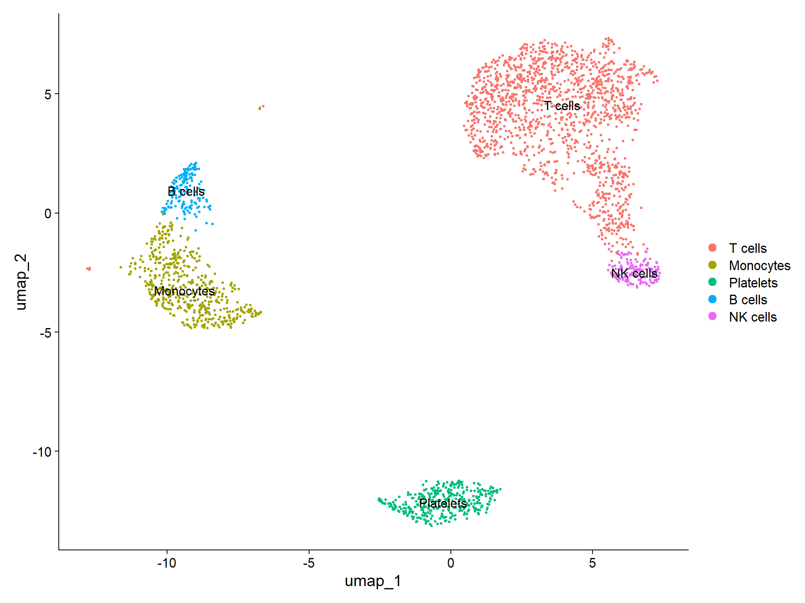
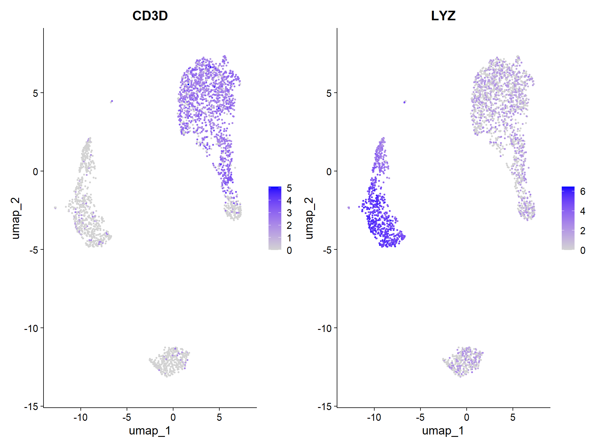
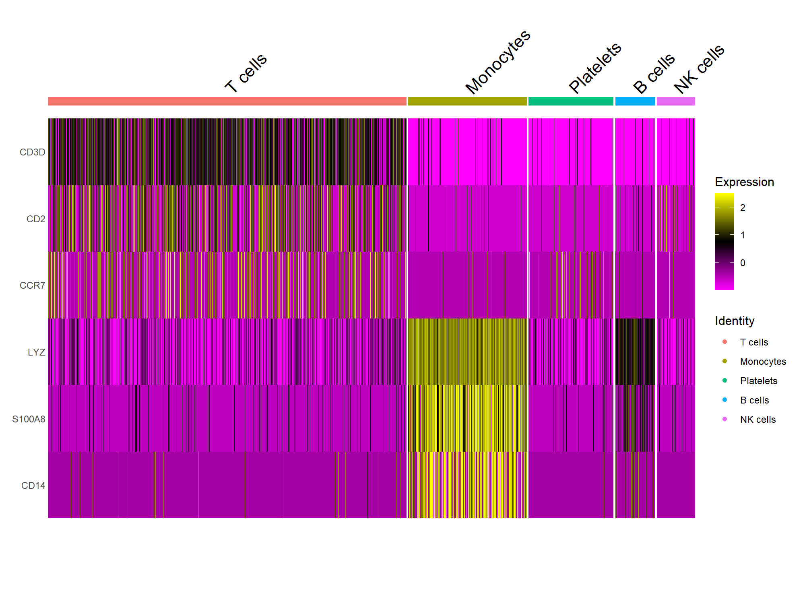
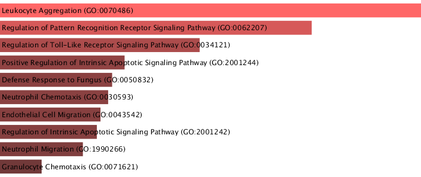
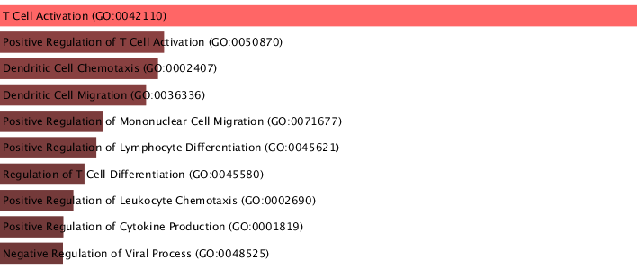

# Single-cell RNA-seq analysis using Seurat (PBMC dataset)

This repository presents an end-to-end single-cell RNA-seq (scRNA-seq) analysis of a PBMC dataset using Seurat. The workflow is designed to identify immune cell populations, characterize marker genes, and derive biological insights through differential expression and functional enrichment analysis.

The analysis demonstrates clear separation of major immune cell types and highlights key transcriptomic signatures underlying adaptive and innate immune responses.

## Project overview

This workflow includes: 

- Quality control and filtering
- Normalization and scaling
- PCA and dimensionality reduction
- Clustering and UMAP visualization
- Cell type annotation using canonical markers
- Differential expression analysis (T cells vs Monocytes)
- Functional enrichment analysis (GO Biological Process)

## Results

### UMAP clustering

### Marker gene expression

### Heatmap of selected marker genes

### Functional enrichment (T cells)

### Functional enrichment (Monocytes)

## Key biological insights

- **T cells** show high expression of canonical markers such as *CD3D*, *CD2*, and *CCR7*
- **Monocytes** are enriched for *LYZ*, *S100A8*, and *CD14*
- Differential expression confirms strong lineage-specific gene signatures
- Functional enrichment highlights:
  - **T cells** → T cell activation, cytokine signaling, lymphocyte differentiation
  - **Monocytes** → Toll-like receptor signaling, innate immune response, leukocyte chemotaxis

## Tools used

- R
- Seurat
- dplyr
- Enrichr

## Repository contents

- `analysis.R` — main Seurat workflow script
- `umap.png` — UMAP visualization of cell clusters
- `featureplot.png` — marker gene expression visualization
- `heatmap.png` — heatmap of selected genes
- `tcell_enrichment_GO.png` — enrichment results for T cells
- `monocyte_enrichment_GO.png` — enrichment results for monocytes

## How to Run

R
source("analysis.R")

## Objective

This project was developed as a transition from bulk RNA-seq and functional genomics to single-cell transcriptomics, with emphasis on biological interpretation, reproducible analysis, and clear data visualization.

